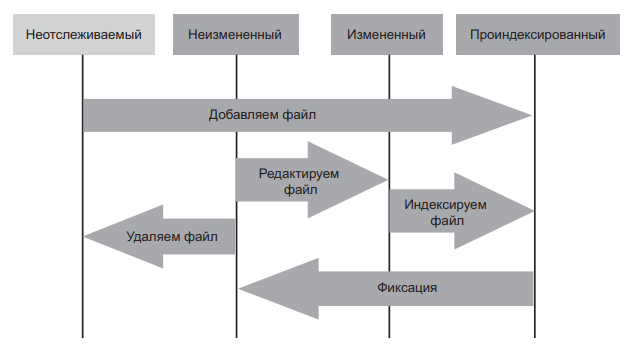

## Основные команды Git 1-го семинара

>   **git init** - создание локального репозитория

>   **git status** – получить информацию от git о его текущем состоянии

>   **git add** – добавить файл или файлы к следующему коммиту

>   **git commit -m “message”** – создание коммита.

>   **git log** – вывод на экран истории всех коммитов с их хеш-кодами

>   **git checkout** – переход от одного коммита к другому

>   **git checkout master(main)** – вернуться к актуальному состоянию и продолжить работу

>   **git diff** – увидеть разницу между текущим файлом и закоммиченным файлом

## Запись изменений в репозиторий
*   Каждый файл в рабочей папке может пребывать в одном из двух состояний: отслеживаемом и неотслеживаемом. Первый случай — это файлы, входящие в последний снимок системы; они могут быть неизмененными, измененными и подготовленными к фиксации. Второй случай — это все остальные файлы рабочей папки, не вошедшие в последний снимок системы и не проиндексированные для последующей фиксации. После первого клонирования репозитория все файлы оказываются отслеживаемыми и неизмененными, потому что вы просто выгрузили их и пока не отредактировали.

 *  _Отредактированный файл Git рассматривает как измененный, ведь его состояние отличается от последнего зафиксированного. Вы индексируете эти измененные файлы, фиксируете все проиндексированные изменения, после чего цикл повторяется_

                  Жизненный цикл состояния файлов Рис.1

##  Дополнительный материал для изучения:
1. С. Чакон, Б. Штауб. Git для профессионального программиста;
2. Курс лекций от Ильнара Шафигуллина на geekbrains.by;
3. Курс семинаров с Иваном Линцовым на geekbrains.by;

## Основные команды Git 2-го семинара

>   **git branch** *"master"* – создать новую ветку c именем master

>   **git checkout** -b <название ветки> - создание ветки и переход к ней

>   **git branch** -d <название ветки> – удалить ветку (git branch -d master)
